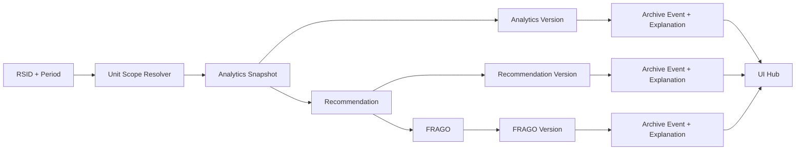

# Intelligence Release Readiness

Date: 2026-05-09
Scope: Steps 1-10 intelligence stack (hardening-only in Step 10)

## 1. Architecture Summary

The intelligence system is a deterministic, append-only decision support pipeline:

1. Unit scope resolution expands RSID anchor to subordinate scope.
2. Analytics snapshots are generated and versioned append-only.
3. Recommendations are generated from analytics context and versioned append-only.
4. FRAGO content is generated from recommendations and versioned append-only.
5. Every version creation writes a matching archive event.
6. Every archive event includes a deterministic explanation object.
7. UI surfaces analytics, recommendations, FRAGO, versions, compare, and archive history.

Step 10 hardening adds:

- In-process TTL/LRU caching for high-frequency reads.
- Request de-duplication and response caching on UI intelligence API calls.
- Standardized intelligence error envelopes.
- Structured JSON logging for key intelligence events.
- Consistent loading/error/retry and transient error toasts.

## 2. Data Flow Diagrams

### 2.1 Core Pipeline



### 2.2 Retrieval and Comparison

```mermaid
flowchart TD
  UI[UI Request] --> E1[/versions/detail]
  UI --> E2[/compare/versions]
  UI --> E3[/archive/events]
  E1 --> VV[get_version]
  E1 --> AV[get_archive_event]
  E2 --> VV
  E2 --> AV
  E3 --> AA[Archive query]
```

## 3. Versioning, Archival, and Explanation Flow

- Versioning is append-only across analytics, recommendation, and FRAGO entities.
- Archive creation is explicit and append-only for each version row.
- Explanation object is deterministic for entity type, id, version number, content fingerprint, and metadata fingerprint.
- Retrieval endpoints return both archive_event and explanation for deterministic auditing.

## 4. API Inventory (Intelligence)

- POST /api/v2/intelligence/recommendations/rop-srp
- POST /api/v2/intelligence/recommendations/school-prioritization
- GET /api/v2/intelligence/recommendations
- GET /api/v2/intelligence/fragos/{frago_version_id}
- GET /api/v2/intelligence/analytics/{snapshot_id}/versions
- GET /api/v2/intelligence/recommendations/{record_id}/versions
- GET /api/v2/intelligence/fragos/{frago_id}/versions
- GET /api/v2/intelligence/archive/events
- GET /api/v2/intelligence/versions/detail
- POST /api/v2/intelligence/compare/versions
- POST /api/v2/intelligence/compare/analytics
- POST /api/v2/intelligence/compare/recommendations
- POST /api/v2/intelligence/compare/fragos

## 5. UI Inventory (Intelligence)

- Intelligence Hub shell tab
- Analytics page
- Recommendations page
- FRAGO page
- Versions page
- Compare page
- History page
- Shared RSID selector and period selector
- Shared async loading/error/retry UI
- Global transient toast notifications

## 6. Performance Benchmarks (Step 10 Targets)

Benchmarks are measured in local environment and intended as release gates:

- Unit scope resolver cache hit path: sub-5 ms median
- Version list retrieval cache hit path: sub-10 ms median
- Archive event retrieval cache hit path: sub-10 ms median
- UI API de-duplication: duplicate concurrent requests collapse to single network call
- UI cache TTL window: 30 seconds default for intelligence reads

## 7. Known Limitations

- Cache layer is in-process and non-distributed.
- Cache invalidation is local to process lifetime.
- Playwright suite is provided but depends on local UI server lifecycle.
- Structured logs rely on application log aggregation configuration outside this repository.

## 8. Deployment Steps

1. Run backend tests:
   - pytest services/api/tests/test_versioning_append_only.py -q
   - pytest services/api/tests/test_archival_explanations.py -q
   - pytest services/api/tests/test_integration_end_to_end.py -q
2. Run frontend checks:
   - cd taaip-dashboard
   - npm run type-check
   - npm run build
3. Optional UI integration checks:
   - npx playwright test tests/intelligence-ui.playwright.spec.mjs
4. Deploy application artifacts.
5. Validate intelligence endpoints and hub UI in environment.

## 9. Release Decision Checklist

- [ ] No schema changes in Step 10
- [ ] No new intelligence endpoints in Step 10
- [ ] No new intelligence logic introduced
- [ ] Backend and frontend checks pass
- [ ] End-to-end intelligence chain verified
- [ ] Logging and error envelopes validated
- [ ] UX loading/error consistency verified
